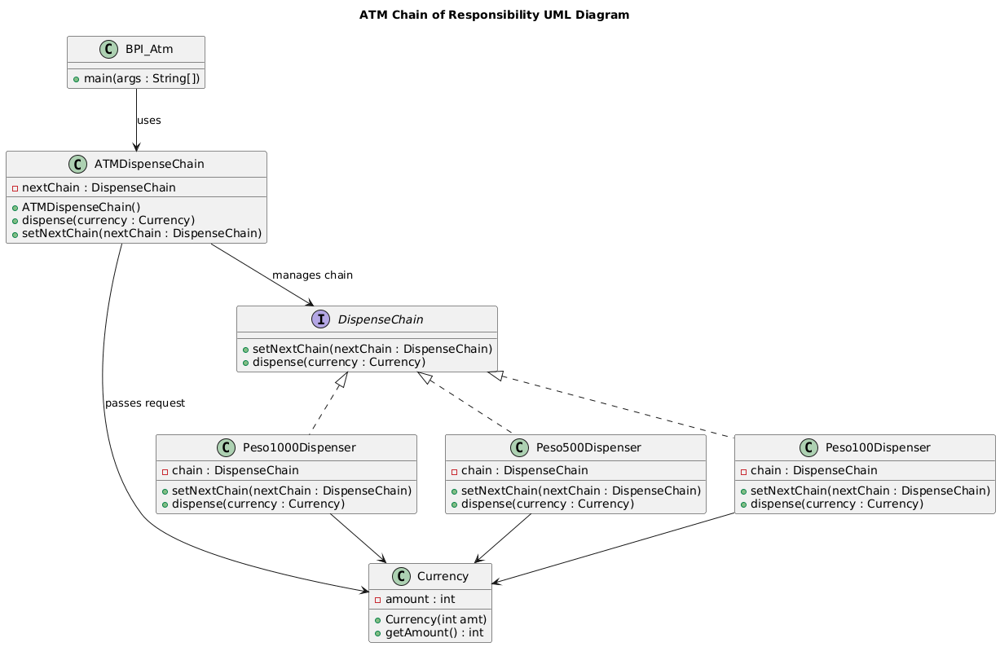

# Chain of Responsibility Design Pattern

## Module Objectives
- Learn how the Chain of Responsibility pattern allows for the distribution of responsibilities among objects, enabling multiple objects to handle a request.
- Explore how implementing the Chain of Responsibility pattern can enhance code maintainability by promoting single responsibility for each object in the chain.
- Discover how the Chain of Responsibility pattern facilitates dynamic request handling at runtime.

---

The Chain of Responsibility design pattern is a behavioral pattern that allows passing requests along a chain of potential handlers until one of them handles the request. Each handler in the chain decides either to process the request or pass it on to the next handler in the sequence.

## Benefits
- **Decoupling:** Promotes loose coupling between the client and the specific handlers, making the code more adaptable and easier to maintain.
- **Flexibility:** New handlers can be added to the chain dynamically without modifying existing code, allowing for future extension and customization.
- **Scalability:** Facilitates adding new functionalities without major code changes, enhancing the application's potential for growth.
- **Complexity:** Overly complex chains with numerous handlers can be difficult to manage and debug, requiring careful design and implementation to avoid potential issues.
- **Performance:** Traversing the chain can introduce additional overhead due to multiple method calls, which might be a concern in performance-critical applications.

By understanding these elements and considering the trade-offs, developers can effectively utilize the Chain of Responsibility design pattern to create maintainable, scalable, and flexible object-oriented systems.

## Elements
The elements of the Chain of Responsibility design pattern include:
- **Request:** The action or operation that needs to be performed. It can be a message, a data structure, or any other type of information that needs to be processed.
- **Handler:** An object that can process the request. Each handler in the chain has a specific responsibility for processing the request.
- **Chain:** A series of handlers linked together. Upon receiving a request, each handler decides whether to process the request or pass it to the next handler in the chain.
- **Client:** The object that initiates the request. It sends the request to the first handler in the chain and may or may not be aware of which handler will ultimately process the request.
- **Concrete Handlers:** Specific implementations of the handler interface. Each concrete handler has its own logic for processing the request and decides whether to pass the request along the chain.
- **Context:** The environment in which the handlers operate. It may include additional information or data needed by the handlers to process the request.

These elements work together to create a flexible and dynamic system for processing requests. The Chain of Responsibility pattern allows for the distribution of responsibilities among objects, enabling multiple objects to handle a request. It also promotes loose coupling between the sender and receiver of a request, allowing for easy addition, removal, or reordering of handlers in the chain without impacting the system.

---

## Problem
We will design an ATM system for BPI (Bank of the Philippine Islands) that dispenses cash in denominations of 1000 pesos, 500 pesos, and 100 pesos bills. The system should follow the Chain of Responsibility design pattern to handle the dispensing of cash requests efficiently.

---

---

In this implementation, ATMDispenseChain class handles the dispensing logic for BPI's ATM system with denominations of 1000, 500, and 100 peso bills. The BPI_Atm class allows users to adjust (hard-coded) an amount and initiates the dispensing process using the Chain of Responsibility pattern.

This design ensures that the ATM system dispenses cash in the specified denominations according to the requested amount.

---

### Pattern Elements in Example
- **Handler:** The handler objects are the concrete classes that implement the CurrencyDispenser abstract class. In this case, there are three handlers: Peso1000Dispenser, Peso500Dispenser, and Peso100Dispenser. Each handler is responsible for dispensing a specific denomination of currency.
- **Chain:** The chain is represented by the ATMDispenserChain class. It sets up the sequence of handlers by linking them together using the setNextChain() method. The chain is responsible for passing the request along the sequence of handlers until one of them handles it.
- **Request:** The request is represented by the dispense() method call made on the first handler in the chain. In this case, the request is to dispense a specific amount of currency.
- **Client:** The client is the ATMDispenseChain class that creates and initializes the chain of handlers. It sends the request to the first handler in the chain by calling the dispense() method.
- **Context:** The context includes the ATMDispenseChain class, which manages the chain of handlers and ensures that the request is passed along the chain until it is handled.

---

## References

Gamma, E., Helm, R., Johnson, R., & Vlissides, J. (1995). Design patterns: Elements of reusable object-oriented software (Vol. 12). Addison-Wesley.

